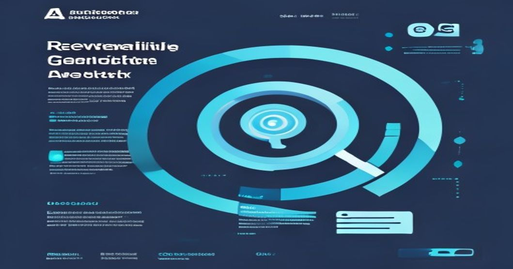

```yaml
---
title: "How to Architect Reliable RAG Systems for Enterprise: Patterns for Indexing, Query Routing, and On-the-Fly Data Updates"
tags: [RAG, Retrieval-Augmented Generation, Enterprise Search, Vector Databases, LLMs, Architecture, Python]
---


# How to Architect Reliable RAG Systems for Enterprise: Patterns for Indexing, Query Routing, and On-the-Fly Data Updates

_By Sheikh Muhammad Qasim | ML Architect_

---

## TL;DR:
- Retrieval-Augmented Generation (RAG) is a powerful approach to build enterprise search systems that are accurate, contextual, and scalable.
- Architecting reliable RAG solutions requires careful design of **indexing pipelines**, **query routing mechanisms**, and **real-time updates** for the vector database.
- Learn how to combine **vector search** tools (e.g., Pinecone, Weaviate) with **large language models (LLMs)** for building production-ready RAG systems.

---

## Introduction: Why This Matters NOW

Enterprise search is no longer about simple keyword matching. Today's organizations sit on vast repositories of unstructured data—documents, emails, knowledge bases, support tickets, and more. While large language models (LLMs) like GPT-4 have proven adept at generating human-like text, they lack direct access to an organization's internal knowledge. Moreover, they often "hallucinate," confidently generating inaccurate or irrelevant results.

This is where **Retrieval-Augmented Generation (RAG)** shines. By pairing LLMs with a **vector-based retrieval system**, RAG ensures that generated responses are grounded in a trusted knowledge base. The result is a search system that delivers precise and accurate information, even in domains with highly specialized requirements (e.g., legal, healthcare, finance).

However, building reliable RAG systems for enterprise introduces practical challenges:
- **Indexing:** How do we efficiently update and index data for search at scale?
- **Query Routing:** How do we intelligently fetch the most relevant context for generation while minimizing latency?
- **On-the-Fly Updates:** How do we ensure that new data is immediately available for queries without downtime?

In this article, I'll guide you through designing a robust RAG system for enterprise use cases, complete with code examples, architectural patterns, and lessons learned from real-world deployments.

---

## 1. High-Level RAG Architecture

Before diving into implementation, let me define the core components of a RAG system:

1. **Knowledge Base (KB):** A collection of data (documents, FAQs, customer support tickets, etc.) stored as dense vector embeddings in a **vector database** like Pinecone, Weaviate, or FAISS. Metadata (e.g., source, timestamp) is often attached to each vector for filtering.
   
2. **Embedding Model:** A transformer-based model, such as OpenAI’s `text-embedding-ada-002` or Sentence Transformers, converts text into high-dimensional vectors for semantic similarity searches.

3. **Retriever:** A module that retrieves the top-k most relevant embeddings from the vector database given a query.

4. **LLM Generative Model:** An LLM (e.g., OpenAI's GPT-4 or an in-house fine-tuned model) generates responses by combining the query and retrieved context.

5. **Query Router:** An intelligent routing layer that decides which retrieval strategies to use (e.g., keyword search, vector search, or both) based on the query type.

---

### Architecture Diagram (ASCII)

```
+---------------+              +------------------+            +-------------------+
| User Query    |              |   Query Router   |            |    Retriever      |
| (Natural Text)|   ------->   |  (Rule/ML Based) |   ----->   | (Vector Database) |
|               |              +------------------+            |  (e.g., Weaviate) |
+---------------+                     |                        +-------------------+
                                       v
                          +-------------------------+
                          | LLM (e.g., GPT-4)       |
                          | with Context Injection  |
                          +-------------------------+
                                       |
                                       v
                      +-----------------------------+
                      | Generated Response          |
                      +-----------------------------+
```

---

## 2. Technical Deep Dive: Building the Core Components

### **2.1. Indexing Your Knowledge Base**

Efficient indexing is the foundation of any RAG system. In enterprise scenarios, data is often dynamic, requiring continuous updates without disrupting availability.

Here’s an example implementation using **Pinecone** for indexing documents:

```python
from sentence_transformers import SentenceTransformer
import pinecone

# Initialize the embedding model and Pinecone
embed_model = SentenceTransformer('all-MiniLM-L6-v2')
pinecone.init(api_key="your-pinecone-api-key", environment="us-west1-gcp")
index = pinecone.Index("enterprise-search-index")

# Sample data
documents = [
    {"id": "doc1", "content": "How to reset your password.", "category": "IT Support"},
    {"id": "doc2", "content": "Company holiday schedule for 2023.", "category": "HR"}
]

# Indexing documents
for doc in documents:
    vector = embed_model.encode(doc['content']).tolist()
    metadata = {"category": doc["category"]}
    index.upsert([(doc["id"], vector, metadata)])

print("Documents indexed successfully!")
```

#### **Patterns for Indexing**:
- Use **batch indexing** for bulk data ingestion to minimize network overhead.
- Store metadata (e.g., tags, timestamps) alongside vectors to enable **filtered retrieval**.
- Handle schema changes by versioning your embeddings (e.g., `v1`, `v2`) to avoid breaking queries.

---

### **2.2. Query Routing and Retrieval**

Query routing determines the optimal retrieval strategy. For example:
- **Structured Queries:** Route to a traditional relational database (e.g., SQL).
- **Unstructured Queries:** Use vector search to fetch semantically similar context.

Here’s how you might implement a hybrid query router in Python:

```python
from typing import List, Dict
from sentence_transformers import SentenceTransformer

def route_query(query: str, index, embed_model) -> List[Dict]:
    if "find:" in query.lower():  # Rule-based routing for keyword queries
        keyword = query.lower().replace("find:", "").strip()
        # Perform keyword-based search
        return index.query(keyword, top_k=5, include_metadata=True, namespace="keyword")
    else:
        # Perform vector-based retrieval
        query_vector = embed_model.encode(query).tolist()
        return index.query(query_vector, top_k=5, include_metadata=True, namespace="vector")

# Example usage
query = "How do I reset my password?"
results = route_query(query, index, embed_model)
for result in results["matches"]:
    print(result)
```

#### **Key Considerations**:
- Use hybrid search where both vector similarity and keyword matching are combined for better precision.
- Implement **business logic filters** (e.g., by categories or user roles) in the query router.
- Monitor retrieval performance with metrics like latency, recall, and relevance.

---

### **2.3. On-the-Fly Data Updates**

Enterprise data can change frequently. To handle real-time updates:
1. Use **upsert** operations: Add or replace documents by ID without rebuilding the entire index.
2. Implement a **message queue** (e.g., Kafka, RabbitMQ) to process and index updates in real-time.
3. Use a **distributed vector database** for high availability and resilience.

Here’s a Kafka consumer example for ingesting real-time updates:

```python
from kafka import KafkaConsumer
import json

# Kafka consumer to listen for updates
consumer = KafkaConsumer(
    'document-updates',
    bootstrap_servers=['kafka-broker:9092'],
    value_deserializer=lambda x: json.loads(x.decode('utf-8'))
)

for message in consumer:
    doc = message.value
    vector = embed_model.encode(doc['content']).tolist()
    metadata = {"category": doc["category"]}
    index.upsert([(doc["id"], vector, metadata)])
    print(f"Updated document: {doc['id']}")
```

#### **Lessons Learned**:
- Use **versioning** for embeddings to manage transitions during schema or model updates.
- Monitor the freshness of your index using system dashboards or metrics from vector DBs.
- Have a strategy for **handling deletions** in the vector database (e.g., soft deletes).

---

## 3. Practical Lessons Learned from Real Deployments

1. **Latency vs. Recall Tradeoff**: 
   - We found that truncating documents before embedding (e.g., using only the first 512 tokens) significantly reduces embedding time without significantly impacting retrieval quality.
   - Use approximate nearest neighbor (ANN) search algorithms like HNSW for low latency.

2. **Scaling Challenges**:
   - For multi-region deployments, geo-distributed vector databases (e.g., Pinecone) reduce latency for global users.
   - Compress embeddings (e.g., with PCA) when dealing with billion-scale datasets to save storage costs.

3. **Prompt Engineering with Context**:
   - Use **chunking** to feed the LLM smaller, focused data snippets.
   - Always prepend retrieved context to your LLM prompts with clear instructions, e.g., "Use the following document to answer the question."

---

## Key Takeaways

1. **Indexing**: Use vector databases with metadata support (e.g., Pinecone, Weaviate) for efficient bulk and real-time updates.
2. **Query Routing**: Implement hybrid strategies to combine semantic and keyword search for higher relevance.
3. **On-the-Fly Updates**: Use message queues and upsert patterns to ensure your RAG system handles dynamic enterprise data effectively.
4. **LLM Fine-Tuning vs. Prompting**: Start with prompt engineering with retrieved context; consider fine-tuning for domain-specific use.

---

## Further Reading
- [Pinecone Documentation](https://docs.pinecone.io/)
- [LangChain RAG Example](https://python.langchain.com/docs/use_cases/question_answering/)
- [OpenAI's GPT-4 API](https://platform.openai.com/docs/models/gpt-4)
- [Weaviate Documentation](https://weaviate.io/developers)

---

I hope this guide equips you with the insights and tools needed to build production-grade RAG systems for enterprise search. Feel free to drop your thoughts or questions in the comments below!

---