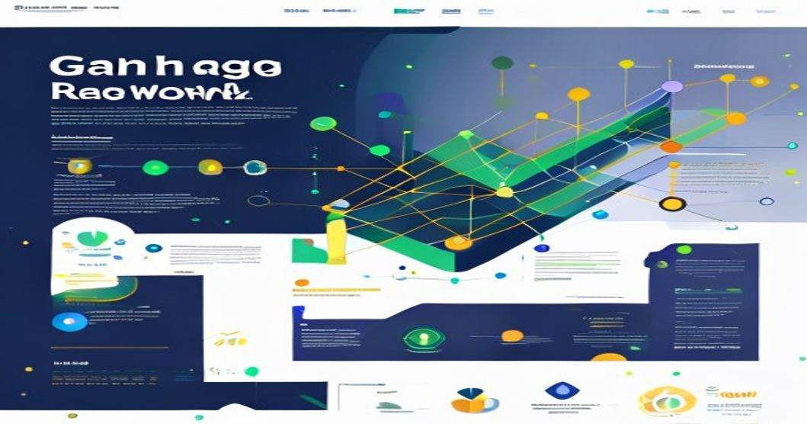

```yaml
tags: [Graph RAG, Knowledge Graphs, LLMs, Retrieval-Augmented Generation, Machine Learning, Knowledge Engineering]
---
```



# When Vector Search Isn't Enough: Building Graph RAG Systems for LLMs

_By Sheikh Muhammad Qasim | ML Architect_

---

### TL;DR:

- Traditional vector search-based RAG systems fail to capture relational and multi-hop reasoning in complex domains.
- **Graph RAG** systems integrate knowledge graphs (KGs) as structured retrieval layers to enhance contextual understanding and multi-hop reasoning.
- Learn how to build a Graph RAG system, combining vector search, graph traversal, and Graph Neural Networks for more robust LLM augmentation.

---

## Introduction: Why This Matters NOW

Large Language Models (LLMs) have transformed how we interact with data, enabling natural language queries and generating human-like text. However, as remarkable as they are, LLMs have limitations—particularly when it comes to retrieving accurate and contextually rich information from external knowledge sources. This is where **Retrieval-Augmented Generation (RAG)** comes into play, bridging LLMs with external knowledge bases such as document stores or vector databases.

Despite its success, the traditional RAG approach often falls short in domains where **complex relationships** or **multi-hop reasoning** are vital. For example, in the biomedical field, answering a query like "What treatments target proteins associated with cancer?" often involves traversing chains of relationships between diseases, proteins, and drugs—something that vector search alone struggles to do effectively.

Enter **Graph RAG**—a novel approach that combines the semantic power of Large Language Models with the structured, relationship-oriented capabilities of **Knowledge Graphs (KGs)** to revolutionize how we retrieve and utilize knowledge.

Let’s dive deeper into Graph RAG, its architecture, and how you can implement it.

---

## The Technical Deep Dive: Graph RAG Systems in Practice

### 1. **How Graph RAG Works**

Graph RAG systems are built around the integration of **two key components**:
- **Knowledge Graphs (KGs):** A graph-based representation of entities and their relationships.
- **Large Language Models (LLMs):** Pre-trained models like GPT-4 or Llama2, fine-tuned or prompted to answer queries.

Instead of exclusively relying on vector embeddings for retrieval, Graph RAG systems incorporate **graph traversal algorithms** or **Graph Neural Networks (GNNs)** to retrieve and reason over structured data.

#### Key Components of Graph RAG:
1. **Graph Traversal Layer:** Uses graph algorithms like breadth-first search (BFS), depth-first search (DFS), or shortest-path heuristics to traverse the KG nodes and edges.
2. **Hybrid Retrieval:** Combines vector similarity search with graph-based context retrieval.
3. **Contextualization with GNNs:** Leverages Graph Neural Networks to encode graph topology and node attributes for downstream tasks.

Here’s a high-level flow:
1. Convert natural language queries into vector embeddings.
2. Use the embedding to perform an initial vector search in a document or node store.
3. Identify relevant nodes/entities in the KG and use graph traversal to retrieve relationships and paths.
4. Aggregate retrieved information to construct a context-enriched prompt for the LLM.

---

### 2. **Code Example: Building a Simple Graph RAG System**

Let’s implement a basic version of a Graph RAG system using Python. We’ll use **NetworkX** for graph traversal, **FAISS** for vector search, and a pre-trained LLM like OpenAI's GPT-4 for generating responses.

#### Step 1: Create a Knowledge Graph

```python
import networkx as nx

# Create a simple knowledge graph
kg = nx.Graph()

# Add nodes (entities)
kg.add_node("Einstein", type="Person")
kg.add_node("Relativity", type="Concept")
kg.add_node("Physics", type="Field")

# Add edges (relationships)
kg.add_edge("Einstein", "Relativity", relation="created")
kg.add_edge("Relativity", "Physics", relation="is_part_of")
kg.add_edge("Einstein", "Physics", relation="contributed_to")

# Visualize graph structure
print("Nodes in KG:", kg.nodes(data=True))
print("Edges in KG:", kg.edges(data=True))
```

#### Step 2: Perform Hybrid Retrieval

```python
from sentence_transformers import SentenceTransformer
import faiss
import numpy as np

# Initialize vector search model and FAISS index
model = SentenceTransformer('all-MiniLM-L6-v2')
faiss_index = faiss.IndexFlatL2(384)  # Assuming 384-d embeddings

# Add node descriptions to FAISS
node_descriptions = {
    "Einstein": "Physicist who developed the theory of relativity.",
    "Relativity": "A theory in physics that describes the relationship between space and time.",
    "Physics": "The field of science concerning the nature and properties of matter and energy."
}
embeddings = [model.encode(desc) for desc in node_descriptions.values()]
faiss_index.add(np.array(embeddings))

# Perform vector search
query = "Who invented relativity?"
query_vector = model.encode(query)
_, indices = faiss_index.search(np.array([query_vector]), k=2)

# Retrieve related entities
retrieved_nodes = [list(node_descriptions.keys())[idx] for idx in indices[0]]
print("Retrieved nodes:", retrieved_nodes)

# Graph traversal to find related entities
related_entities = set()
for node in retrieved_nodes:
    related_entities.update(nx.neighbors(kg, node))

print("Related entities from KG:", related_entities)
```

#### Step 3: Generate Context for the LLM

```python
import openai

# Format context for LLM
context = "\n".join([f"{node}: {node_descriptions[node]}" for node in related_entities])
prompt = f"Context:\n{context}\n\nQuestion: {query}\n\nAnswer:"

# Use OpenAI's GPT-4 API
openai.api_key = "your_openai_api_key"
response = openai.Completion.create(
    engine="text-davinci-003",
    prompt=prompt,
    max_tokens=150
)

print("LLM Response:", response['choices'][0]['text'].strip())
```

---

### 3. **Architecture Diagram (ASCII Representation)**

```plaintext
User Query
   |
+----------------+
|  LLM (GPT-4,   |
|  Llama2, etc.) |
+----------------+
   |      ^
   v      |
Vector Search   \
   |             \ Context Aggregation
+----------------+  /
| FAISS Index    |<-+
+----------------+
   |
Graph Traversal
   |
+---------------------------+
| Knowledge Graph (NetworkX |
| or Neo4j)                 |
+---------------------------+
```

---

### 4. **Lessons Learned from Production**

1. **Balancing Precision and Recall**  
   - *Challenge:* Over-reliance on graph traversal can overly constrain retrieval, leading to overly precise but incomplete results.  
   - *Solution:* Use a hybrid approach—start with vector search for broad recall, then refine with graph traversal for precision.

2. **Scalability Concerns**  
   - *Challenge:* Large KGs with millions of nodes/edges can make traversal computationally expensive.  
   - *Solution:* Use graph databases like **Neo4j** or **TigerGraph** with optimized queries instead of in-memory graphs like NetworkX for large-scale production systems.

3. **Cold Start Problem in KGs**  
   - *Challenge:* Building and curating high-quality KGs from scratch is resource-intensive.  
   - *Solution:* Leverage existing ontologies (e.g., Wikidata, UMLS for biomedical domains) and enrich them with domain-specific data.

4. **Context Window Size in LLMs**  
   - *Challenge:* LLMs have limited context windows, making it tricky to include all relevant graph data.  
   - *Solution:* Use summarization or context prioritization techniques (e.g., edge weighting or clustering) to filter the most relevant information.

---

### 5. **Key Takeaways**

- **Graph RAG systems** are ideal for domains with complex inter-entity relationships, such as biomedical, legal, and financial industries.
- The hybrid approach—combining vector search with knowledge graph traversal—can dramatically improve the relevance and accuracy of retrieved information.
- Production deployment requires careful attention to **scalability**, **computational cost**, and **knowledge graph quality**.

---

### 6. **Further Reading**
- [Deep Dive into RAG by Facebook AI](https://ai.facebook.com/blog/retrieval-augmented-generation-streamlining-the-creation-of-intelligent-systems/)
- [Neo4j Knowledge Graph Documentation](https://neo4j.com/developer/graph-data-science/)
- [Graph Neural Networks in PyTorch Geometric](https://pytorch-geometric.readthedocs.io/)
- [FAISS: A Library for Efficient Similarity Search](https://faiss.ai/)

---

By embracing Graph RAG, we unlock the ability to provide **contextually rich, accurate, and traceable responses** from LLMs, making them truly effective in complex, real-world applications.