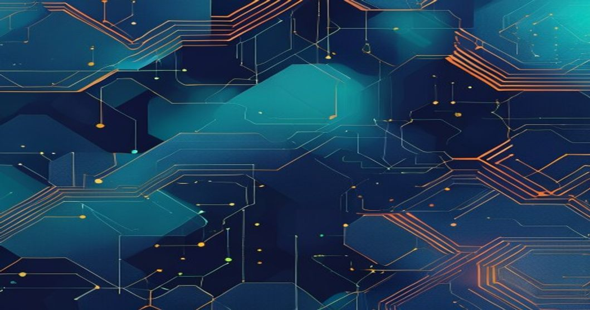

---
tags:
  - Multi-Agent Systems
  - LLM
  - Production Deployment
  - AI Engineering
---

# Deploying Reliable Multi-Agent LLM Workflows: Lessons from Real Production Incidents


## TL;DR
* Multi-agent LLM systems are revolutionizing complex task automation, but deploying them in production requires careful consideration of reliability, safety, and scalability.
* Effective deployment involves designing robust agent interactions, integrating with external tools, and implementing monitoring and guardrails.
* Real-world production experience has highlighted the importance of task decomposition, role-driven collaboration, and asynchronous communication between agents.

## Introduction
The rise of Large Language Models (LLMs) has enabled the development of sophisticated multi-agent systems capable of tackling complex tasks through collaborative workflows. As organizations increasingly adopt these systems for production use cases, ensuring their reliability, safety, and scalability has become paramount. In this article, we'll delve into the technical challenges of deploying multi-agent LLM workflows in production, drawing on real-world experience and lessons learned from actual incidents.

## Technical Deep Dive
At the heart of a multi-agent LLM system lies the orchestration of multiple agents, each potentially driven by a different LLM or specialized for a specific task. Frameworks like AutoGen, LangChain Agents, and CrewAI provide the necessary primitives for agent creation, communication, and task decomposition.

### Task Decomposition and Role-Driven Collaboration
One key aspect of multi-agent systems is the ability to break down complex tasks into manageable sub-tasks. This is often achieved through recursive prompting or chain-of-thought reasoning, where agents with specialized roles ("planner", "executor", "reviewer") collaborate to achieve a common goal.

```python
from langchain.agents import initialize_agent, Tool
from langchain.llms import OpenAI

# Define tools for the agents
tools = [
    Tool(
        name="Code Executor",
        func=execute_code,
        description="Executes Python code and returns the output"
    )
]

# Initialize the executor agent with access to the code execution tool
executor_agent = initialize_agent(
    tools=tools,
    llm=OpenAI(model_name="gpt-4"),
    agent_type="zero-shot-react-description"
)

# Define a task for the executor agent
task = "Write a Python function to calculate the factorial of a number"
response = executor_agent.run(task)
print(response)
```

### Inter-Agent Communication and Asynchronous Processing
Effective communication between agents is crucial for the success of multi-agent systems. This can be achieved through message passing or shared memory mechanisms, often facilitated by technologies like Redis or vector databases.

```python
import redis

# Initialize Redis client for inter-agent communication
redis_client = redis.Redis(host='localhost', port=6379, db=0)

# Define a simple message passing protocol
def send_message(agent_id, message):
    redis_client.publish(agent_id, message)

def receive_message(agent_id):
    pubsub = redis_client.pubsub()
    pubsub.subscribe(agent_id)
    for message in pubsub.listen():
        if message['type'] == 'message':
            return message['data'].decode('utf-8')

# Example usage
send_message('executor_agent', 'Execute the code snippet')
response = receive_message('planner_agent')
print(response)
```

### Architecture Overview
Our production architecture can be visualized as follows:
```
                      +---------------+
                      |  Task Ingress  |
                      +---------------+
                             |
                             |
                             v
                      +---------------+
                      |  Task Decomposer  |
                      |  (Planner Agent)  |
                      +---------------+
                             |
                             |
                             v
                      +---------------+---------------+
                      |             |               |
                      |  Executor    |  Reviewer      |
                      |  Agent       |  Agent         |
                      +---------------+---------------+
                             |             |
                             |             |
                             v             v
                      +---------------+---------------+
                      |             |               |
                      |  Code        |  Review        |
                      |  Execution   |  and Feedback  |
                      +---------------+---------------+
```
This architecture highlights the key components involved in our multi-agent workflow: task ingress, task decomposition, execution, review, and feedback.

## Production Lessons Learned
Deploying multi-agent LLM systems in production has taught us several valuable lessons:

* **Task decomposition is key**: Breaking down complex tasks into smaller sub-tasks is essential for achieving reliable and accurate results.
* **Role-driven collaboration is crucial**: Assigning explicit roles to agents enables division of labor, improves error correction, and enhances overall system robustness.
* **Asynchronous communication is necessary**: Agents must be able to communicate effectively and asynchronously to handle complex workflows and varying task durations.
* **Monitoring and guardrails are essential**: Implementing monitoring frameworks and guardrails (e.g., Guardrails AI, RLAIF) helps mitigate hallucinations, controls responses, and ensures overall system safety.

## Key Takeaways
To deploy reliable multi-agent LLM workflows in production:

* Design robust agent interactions and communication protocols.
* Implement task decomposition and role-driven collaboration.
* Integrate with external tools and APIs.
* Monitor system performance and implement guardrails.

## Further Reading
For more information on multi-agent LLM systems and their deployment, we recommend exploring the following resources:

* [AutoGen](https://github.com/microsoft/autogen): A framework for building conversable agents.
* [LangChain Agents](https://docs.langchain.com/docs/modules/agents/): A library for creating and managing LLM-driven agents.
* [CrewAI](https://github.com/joaopds/crewAI): A framework for role-driven collaboration in multi-agent systems.

By Sheikh Muhammad Qasim | ML Architect